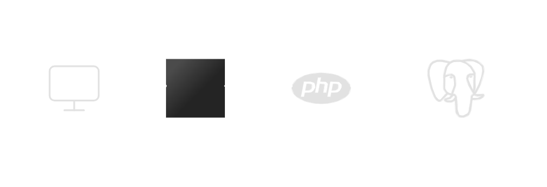

# DecameronHotelManager

## Descripción del Proyecto

DecameronHotelManager es un sistema de gestión hotelera desarrollado para Hoteles Decameron de Colombia. Este proyecto permite ingresar y administrar la información de los hoteles de la compañía, incluyendo sus datos básicos, información tributaria y detalles sobre los tipos de habitaciones y acomodaciones disponibles.

## Arquitectura

<p align="center">

</p>

El proyecto utiliza Laravel para el backend y Vue.js para el frontend, elegidos por:
- La robustez de Laravel como framework PHP con excelente soporte para APIs
- La reactividad y facilidad de uso de Vue.js como framework frontend

### Componentes Clave:

- **Frontend (Vue.js)**: Interactúa con el backend a través de Axios
- **Backend (Laravel)**: Gestiona las solicitudes y la lógica de negocio
- **Base de Datos (PostgreSQL)**: Almacena la información de hoteles y habitaciones

## Instalación

### Prerrequisitos

- Docker
- Docker Compose

### Pasos

1. **Clonar el repositorio:**
   ```bash
   git clone https://github.com/tuusuario/decameron-hotel-api.git
   cd decameron-hotel-api
   ```

2. **Configurar el entorno:**
   ```bash
   cp .env.example .env
   ```

   Asegúrate de configurar las siguientes variables de entorno en el archivo .env:

   ```
   DB_CONNECTION=pgsql
   DB_HOST=pgsql
   DB_PORT=5432
   DB_DATABASE=decameron_hotel_db
   DB_USERNAME=decameron
   DB_PASSWORD=password
   ```

3. **Instalar dependencias:**
   ```bash
   docker run --rm \
       -u "$(id -u):$(id -g)" \
       -v "$(pwd):/var/www/html" \
       -w /var/www/html \
       laravelsail/php83-composer:latest \
       composer install --ignore-platform-reqs
   ```

4. **Iniciar servicios:**
   ```bash
   ./vendor/bin/sail up -d
   ```

5. **Generar clave de aplicación:**
   ```bash
   ./vendor/bin/sail artisan key:generate
   ```

6. **Ejecutar migraciones:**
   ```bash
   ./vendor/bin/sail artisan migrate:fresh --seed
   ```

## Documentación API

La documentación de la API estará disponible en [http://localhost/api/documentation](http://localhost/api/documentation) una vez que el proyecto esté en ejecución.

## Acceso

- Aplicación: [http://localhost](http://localhost)

## Características

- Gestión de hoteles (agregar, editar, listar, eliminar)
- Gestión de tipos de habitaciones y acomodaciones
- Validación de acomodaciones según el tipo de habitación
- Interfaz de usuario responsive para pantallas de 13 y 15 pulgadas

## Tecnologías Utilizadas

- **Backend**: Laravel (PHP)
- **Frontend**: Vue.js
- **Base de Datos**: PostgreSQL
- **Contenedorización**: Docker

## Autor

LinkedIn: [Duvan Gamboa](https://www.linkedin.com/in/duvan-gamboa-5193951b2/)
Email: [duvangamboa8@gmail.com](mailto:duvangamboa8@gmail.com)  
